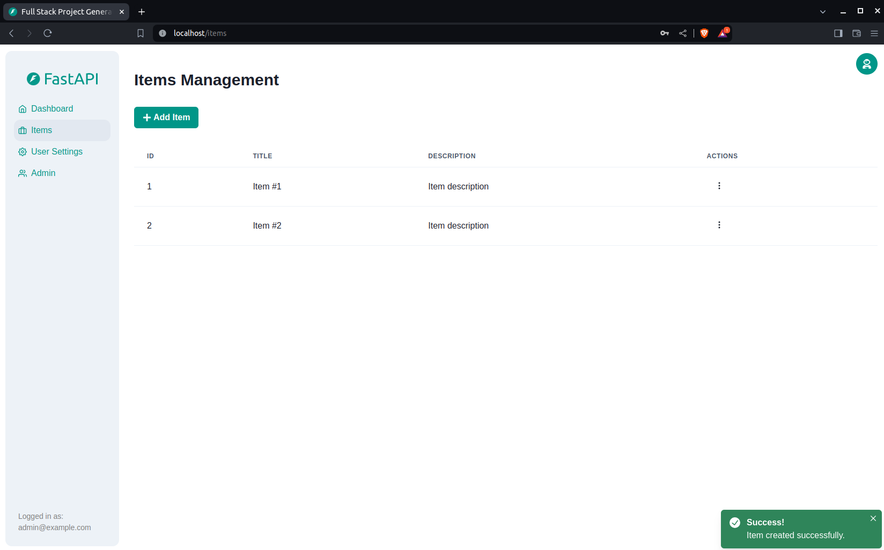
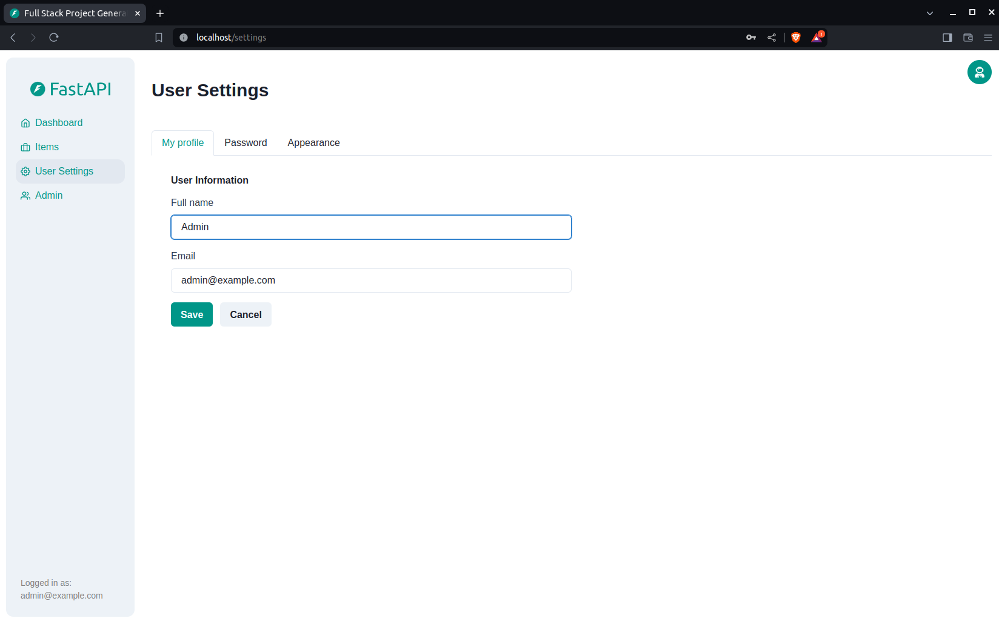

# Full Stack FastAPI 템플릿

<a href="https://github.com/fastapi/full-stack-fastapi-template/actions?query=workflow%3ATest" target="_blank"></a>
<a href="https://coverage-badge.samuelcolvin.workers.dev/redirect/fastapi/full-stack-fastapi-template" target="_blank"></a>

## 기술 스택 및 주요 기능

- ⚡ Python 백엔드 API를 위한 [**FastAPI**](https://fastapi.tiangolo.com)
    - 🧰 Python SQL 데이터베이스 상호작용(ORM)을 위한 [SQLModel](https://sqlmodel.tiangolo.com)
    - 🔍 데이터 검증 및 설정 관리를 위한 [Pydantic](https://docs.pydantic.dev) (FastAPI에서 사용)
    - 💾 SQL 데이터베이스로 [PostgreSQL](https://www.postgresql.org) 사용
- 🚀 프론트엔드를 위한 [React](https://react.dev)
    - 💃 TypeScript, hooks, Vite 등 최신 프론트엔드 스택 사용
    - 🎨 프론트엔드 컴포넌트를 위한 [Chakra UI](https://chakra-ui.com)
    - 🤖 자동 생성되는 프론트엔드 클라이언트
    - 🧪 End-to-End 테스팅을 위한 [Playwright](https://playwright.dev)
    - 🦇 다크 모드 지원
- 🐋 개발 및 프로덕션을 위한 [Docker Compose](https://www.docker.com)
- 🔒 기본적으로 안전한 비밀번호 해싱
- 🔑 JWT (JSON Web Token) 인증
- 📫 이메일 기반 비밀번호 복구
- ✅ [Pytest](https://pytest.org)를 사용한 테스트
- 📞 리버스 프록시/로드 밸런서로 [Traefik](https://traefik.io) 사용
- 🚢 자동 HTTPS 인증서 처리를 위한 프론트엔드 Traefik 프록시 설정 방법을 포함한 Docker Compose 배포 가이드
- 🏭 GitHub Actions 기반 CI (지속적 통합) 및 CD (지속적 배포)

### 대시보드 로그인

[](https://github.com/fastapi/full-stack-fastapi-template)

### 대시보드 - 관리자

[](https://github.com/fastapi/full-stack-fastapi-template)

### 대시보드 - 사용자 생성

[](https://github.com/fastapi/full-stack-fastapi-template)

### 대시보드 - 아이템

[](https://github.com/fastapi/full-stack-fastapi-template)

### 대시보드 - 사용자 설정

[](https://github.com/fastapi/full-stack-fastapi-template)

### 대시보드 - 다크 모드

[](https://github.com/fastapi/full-stack-fastapi-template)

### 인터랙티브 API 문서

[](https://github.com/fastapi/full-stack-fastapi-template)

## 사용 방법

이 저장소를 **포크하거나 클론**하여 바로 사용할 수 있습니다.

✨ 그냥 작동합니다. ✨

### 비공개 저장소로 사용하는 방법

비공개 저장소를 만들고 싶다면, GitHub는 포크의 공개 설정 변경을 허용하지 않으므로 단순히 포크할 수 없습니다.

하지만 다음과 같이 할 수 있습니다:

- 새 GitHub 저장소를 생성합니다. 예: `my-full-stack`
- 이 저장소를 수동으로 클론하고, 사용하고자 하는 프로젝트 이름으로 설정합니다. 예: `my-full-stack`:

```bash
git clone git@github.com:fastapi/full-stack-fastapi-template.git my-full-stack
```

- 새 디렉토리로 이동합니다:

```bash
cd my-full-stack
```

- GitHub 인터페이스에서 복사한 새 저장소를 origin으로 설정합니다. 예:

```bash
git remote set-url origin git@github.com:octocat/my-full-stack.git
```

- 나중에 업데이트를 받을 수 있도록 이 저장소를 다른 "remote"로 추가합니다:

```bash
git remote add upstream git@github.com:fastapi/full-stack-fastapi-template.git
```

- 코드를 새 저장소에 푸시합니다:

```bash
git push -u origin master
```

### 원본 템플릿으로부터 업데이트

저장소를 클론하고 변경 작업을 한 후, 원본 템플릿의 최신 변경사항을 가져오고 싶을 수 있습니다.

- 원본 저장소를 remote로 추가했는지 확인합니다. 다음 명령어로 확인할 수 있습니다:

```bash
git remote -v

origin    git@github.com:octocat/my-full-stack.git (fetch)
origin    git@github.com:octocat/my-full-stack.git (push)
upstream    git@github.com:fastapi/full-stack-fastapi-template.git (fetch)
upstream    git@github.com:fastapi/full-stack-fastapi-template.git (push)
```

- 병합하지 않고 최신 변경사항을 가져옵니다:

```bash
git pull --no-commit upstream master
```

이렇게 하면 커밋하지 않고 이 템플릿의 최신 변경사항을 다운로드하므로, 커밋하기 전에 모든 것이 올바른지 확인할 수 있습니다.

- 충돌이 있으면 편집기에서 해결합니다.

- 완료되면 변경사항을 커밋합니다:

```bash
git merge --continue
```

### 구성 설정

`.env` 파일의 설정을 업데이트하여 구성을 사용자 정의할 수 있습니다.

배포하기 전에 최소한 다음 값들을 변경해야 합니다:

- `SECRET_KEY`
- `FIRST_SUPERUSER_PASSWORD`
- `POSTGRES_PASSWORD`

이러한 값들은 시크릿에서 환경 변수로 전달할 수 있으며 그렇게 해야 합니다.

자세한 내용은 [deployment.md](./deployment.md) 문서를 참조하세요.

### 시크릿 키 생성

`.env` 파일의 일부 환경 변수는 기본값이 `changethis`입니다.

시크릿 키로 변경해야 하며, 다음 명령어로 시크릿 키를 생성할 수 있습니다:

```bash
python -c "import secrets; print(secrets.token_urlsafe(32))"
```

생성된 내용을 복사하여 비밀번호/시크릿 키로 사용합니다. 다른 보안 키를 생성하려면 명령어를 다시 실행하세요.

## Copier를 사용한 대체 방법

이 저장소는 [Copier](https://copier.readthedocs.io)를 사용한 새 프로젝트 생성도 지원합니다.

모든 파일을 복사하고, 구성 질문을 하며, 답변으로 `.env` 파일을 업데이트합니다.

### Copier 설치

다음 명령어로 Copier를 설치할 수 있습니다:

```bash
pip install copier
```

또는 [`pipx`](https://pipx.pypa.io/)가 있다면 다음과 같이 실행할 수 있습니다:

```bash
pipx install copier
```

**참고**: `pipx`가 있다면 copier 설치는 선택사항이며, 직접 실행할 수 있습니다.

### Copier로 프로젝트 생성

새 프로젝트 디렉토리의 이름을 정합니다. 아래에서 사용할 것입니다. 예: `my-awesome-project`.

프로젝트의 상위 디렉토리로 이동하여, 프로젝트 이름과 함께 명령어를 실행합니다:

```bash
copier copy https://github.com/fastapi/full-stack-fastapi-template my-awesome-project --trust
```

`pipx`가 있고 `copier`를 설치하지 않았다면, 직접 실행할 수 있습니다:

```bash
pipx run copier copy https://github.com/fastapi/full-stack-fastapi-template my-awesome-project --trust
```

**참고** `--trust` 옵션은 `.env` 파일을 업데이트하는 [생성 후 스크립트](https://github.com/fastapi/full-stack-fastapi-template/blob/master/.copier/update_dotenv.py)를 실행하기 위해 필요합니다.

### 입력 변수

Copier는 프로젝트를 생성하기 전에 몇 가지 데이터를 요청합니다.

하지만 걱정하지 마세요. 나중에 `.env` 파일에서 언제든지 업데이트할 수 있습니다.

입력 변수와 기본값(일부는 자동 생성)은 다음과 같습니다:

- `project_name`: (기본값: `"FastAPI Project"`) 프로젝트 이름, API 사용자에게 표시됨 (.env에 저장)
- `stack_name`: (기본값: `"fastapi-project"`) Docker Compose 레이블 및 프로젝트 이름에 사용되는 스택 이름 (공백, 마침표 없음) (.env에 저장)
- `secret_key`: (기본값: `"changethis"`) 보안에 사용되는 프로젝트 시크릿 키, .env에 저장, 위의 방법으로 생성 가능
- `first_superuser`: (기본값: `"admin@example.com"`) 첫 번째 슈퍼유저의 이메일 (.env에 저장)
- `first_superuser_password`: (기본값: `"changethis"`) 첫 번째 슈퍼유저의 비밀번호 (.env에 저장)
- `smtp_host`: (기본값: "") 이메일 전송을 위한 SMTP 서버 호스트, 나중에 .env에서 설정 가능
- `smtp_user`: (기본값: "") 이메일 전송을 위한 SMTP 서버 사용자, 나중에 .env에서 설정 가능
- `smtp_password`: (기본값: "") 이메일 전송을 위한 SMTP 서버 비밀번호, 나중에 .env에서 설정 가능
- `emails_from_email`: (기본값: `"info@example.com"`) 이메일을 보낼 이메일 계정, 나중에 .env에서 설정 가능
- `postgres_password`: (기본값: `"changethis"`) PostgreSQL 데이터베이스 비밀번호, .env에 저장, 위의 방법으로 생성 가능
- `sentry_dsn`: (기본값: "") Sentry를 사용하는 경우 DSN, 나중에 .env에서 설정 가능

## 백엔드 개발

백엔드 문서: [backend/README.md](./backend/README.md)

## 프론트엔드 개발

프론트엔드 문서: [frontend/README.md](./frontend/README.md)

## 배포

배포 문서: [deployment.md](./deployment.md)

## 개발

일반 개발 문서: [development.md](./development.md)

Docker Compose 사용, 커스텀 로컬 도메인, `.env` 구성 등을 포함합니다.

## 릴리스 노트

[release-notes.md](./release-notes.md) 파일을 확인하세요.

## 라이선스

Full Stack FastAPI Template은 MIT 라이선스 조건에 따라 라이선스가 부여됩니다.
